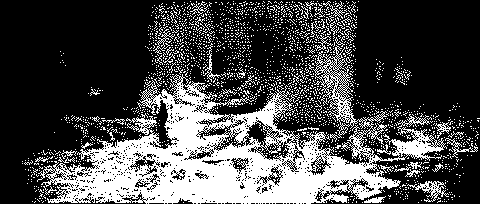

# Ardumovie
## Overview
I had a dream last night about putting Harry Potter on my Arduboy. Wanted to see if it was possible.

## Failed Process
1. Obtain a GIF of Harry Potter
1. `convert harry.gif -coalesce potter.gif`
1. `convert potter.gif -resize 300x64 smaller.gif`
1. `convert smaller.gif -repage 0x0 -crop 128x64+0+0 -gravity center +repage cropped.gif`
1. `convert cropped.gif -monochrome final.gif`
1. Use a sprite sheet converter to change the GIF to a single column sprite sheet

## Results
- The Arduino program takes up 800% of my CPU and never compiles

